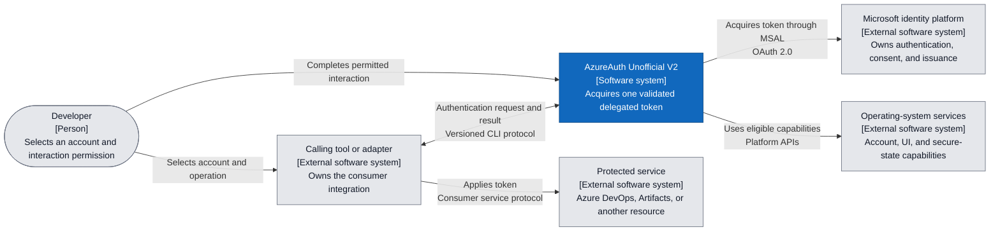
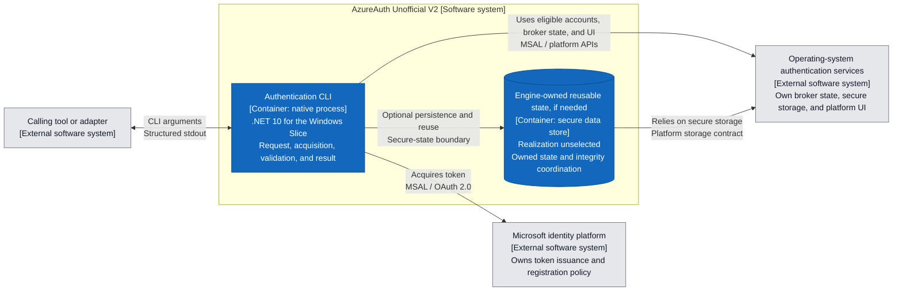
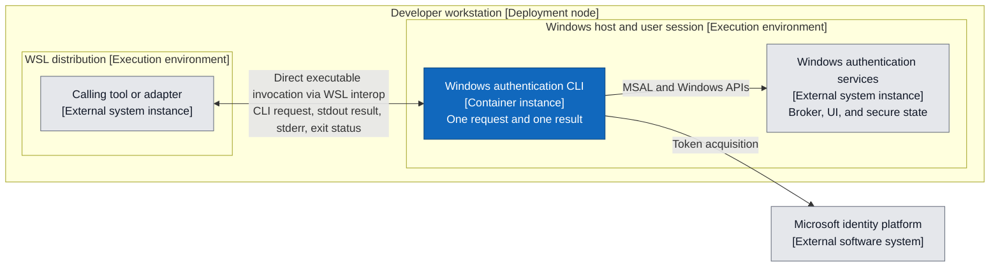
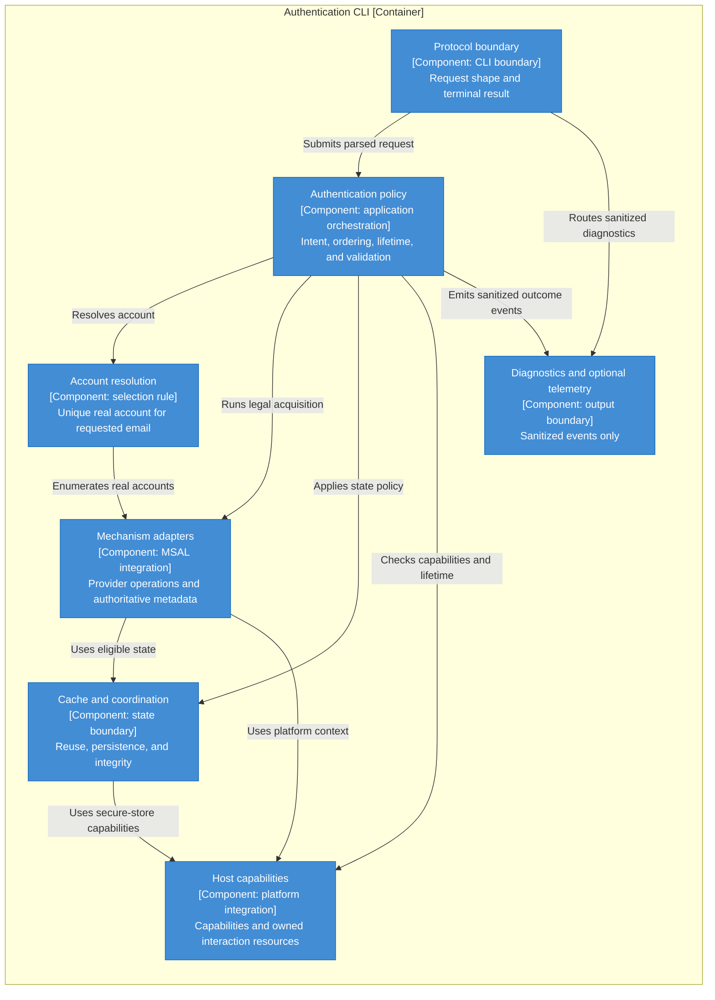

# Architecture Overview

This record defines the current target architecture before implementation. It does not
freeze command names, serialized contracts, platform support, or compatibility behavior.

The [Windows Slice design](../designs/windows-ado-authentication.md) owns the selected
Windows runtime, WAM integration, protocol 1 command-line/process semantics, and Profile
contract. This overview retains the broader conceptual architecture; mechanisms outside
that Slice remain unselected and are not supported by its acceptance.

The Slice's [Native AOT disposition](../designs/windows-ado-authentication.md#native-aot-target-disposition)
defines a Win32 host candidate and an unresolved publishing compatibility premise. It
does not claim implementation readiness. Changing managed UI technology within that
single process adds no broker, consumer protocol, or cross-process bridge.

## System Boundary

The normative product boundary is defined by
[`V2-REQ-001`](../product/requirements/product-boundary.md#v2-req-001-delegated-public-client-scope)
through
[`V2-REQ-005`](../product/requirements/product-boundary.md#v2-req-005-no-personal-access-tokens).
This architecture allocates that behavior to a command-line authentication engine and
separate downstream consumers under decision
[`0004`](../decisions/0004-keep-the-authentication-engine-separate-from-consumers.md).

For the selected personal- and work-account Azure DevOps Slice, the engine returns the
provider access token for direct consumer use. The
[PAT prohibition](../product/requirements/product-boundary.md#v2-req-005-no-personal-access-tokens)
governs acquisition, state, result, and failure paths. The official NuGet provider's
optional SelfDescribing exchange does not become an engine operation or an automatic
personal-account fallback. The
[token-path assessment](../research/v1-public-contract-baseline.md#azure-artifacts-token-forms-and-nuget-paths)
supports the shared acquisition boundary while preserving the distinction between
observed Git access and unobserved NuGet/feed behavior. Consumer-specific presentation
and service authorization remain with adapters.

## Governing Decisions

- [`0002`](../decisions/0002-rebuild-the-authentication-core.md) resets the v1 policy and
  orchestration model while permitting selective mechanism reuse.
- [`0003`](../decisions/0003-treat-client-registration-as-an-external-dependency.md)
  treats client registrations as explicit externally owned configuration.
- [`0004`](../decisions/0004-keep-the-authentication-engine-separate-from-consumers.md)
  keeps consumer protocols outside the core.
- [`0005`](../decisions/0005-establish-independent-operational-identity.md) requires
  independent runtime and distribution identities.

## Design Principles

### Explicit Assumptions and Dependency Responsibilities

Base each design on the accepted requirements, concrete user scenarios, and the documented
contracts of its dependencies. Identify the assumptions that could invalidate a choice
and the boundary responsible for satisfying them. Rely on supported operating-system,
MSAL, broker, and secure-store abstractions within their declared contracts; the engine
does not need to independently reimplement or mechanically prove those abstractions.

The engine remains responsible for its request constraints and required result checks.
Trust in a dependency does not establish an undocumented capability or prove that a
particular profile and host combination satisfies those constraints. When a required
capability is absent, keep that path unavailable. When the limitation blocks a required
journey, report the feasibility gap for owner disposition rather than silently weakening
the requirement or compensating through an expanded application boundary.

### Scenario-Driven Abstractions

Introduce a component, interface, or extension point only when a current scenario,
responsibility boundary, or independently changing dependency justifies it. Evaluate the
abstraction against the primary journey and another applicable scenario or failure path;
do not invent future consumers to justify generality. A conceptual responsibility does
not automatically require a separate service, package, interface, or class.

Keep design and implementation inside the accepted product boundary. Additional consumer
protocols, platform services, or compatibility behavior require an explicit owner scope
decision and the applicable accepted work authorization before work begins.

### Bounded Failure and Proportionate Assurance

When an edge case prevents establishing a required safety condition, use the existing
terminal outcome or mark the path unavailable. Do not add unbounded retries, fallback
chains, or speculative repair mechanisms to make every environment succeed. Apply the
accepted recovery and persistence semantics where the requirements already permit a safe
outcome; fail-closed behavior does not turn every recoverable condition into failure.

The [threat model](../security/threat-model.md#security-design-tradeoffs) owns security
assumptions and mitigation tradeoffs. The
[validation strategy](../validation/strategy.md#test-design-and-evidence-selection)
owns the balance of scenario, unit, contract, and real-environment evidence. Neither
mechanical checks nor exhaustive testing substitutes for contextual design judgment.

### Architecture Views

Use standard C4 system-context and container views, with component views where they
clarify responsibilities inside a container. A C4 container denotes an application or
data store, not necessarily a deployment container. Use UML sequence and state-machine
views for interactions and lifecycles whose ordering or termination matters. Keep each
diagram at one stated level and consistent with the surrounding authoritative text.

Choose diagrams for a concrete reader question; a complete diagram catalog is not a
deliverable. The existing user stories, capability requirements, and validation scenarios
provide the requirements basis. Add a use-case diagram only if it resolves an actual
ambiguity about actors, goals, or the system boundary.

## Replace and Reuse

| V1 area | V2 direction |
| --- | --- |
| `AuthMode` flag composition | Replace with documented deterministic product acquisition policy. |
| Fixed `AuthFlowFactory` ordering | Separate product order, profile compatibility filtering, and typed fallback. |
| `Broker` combining silent and interactive work | Split into policy-distinct operations. |
| Nullable cached-account resolution | Replace with typed account-resolution outcomes. |
| Domain-suffix account preference | Replace with strict full-email resolution and terminal result validation. |
| Token-only `TokenResult` | Replace with a versioned result preserving provider metadata. |
| Exit `1` for most failures | Replace with a typed failure taxonomy and stable process mapping. |
| Global environment interaction policy | Replace with per-request interaction policy. |
| Implicit console-window discovery | Replace with self-contained interactive-surface and completion-channel ownership. |
| MSAL, broker, browser, and device-code calls | Reuse or adapt behind mechanism interfaces. |
| Platform secure-cache integration | Reuse selectively after threat-model and cache-lifecycle review. |
| Packaging and release knowledge | Reuse as evidence; create independent v2 identities and channels. |
| ADO PAT implementation | Excluded by [V2-REQ-005](../product/requirements/product-boundary.md#v2-req-005-no-personal-access-tokens). |

## C4 Structural Views

These views use the [C4 model](https://c4model.com/diagrams), from the engine's system
context to its single CLI application and conceptual components. Mermaid renders the
explicitly labeled C4 element kinds and boundaries; blue elements belong to the engine,
and gray elements are external. A relationship describes
an intended responsibility, not evidence that a host or Client Profile supplies it.
Platform services are external dependencies; MSAL is an in-process library integration.
The WSL deployment below selects direct invocation of the Windows CLI. The concrete
Windows runtime, broker-owned state, and provider integration are defined in the Windows
Slice design. Distributed Profile activation and platform support remain separate gates.

### Level 1: System Context

This view answers who requests authentication, who authenticates the user, and who uses
the resulting token. The engine does not connect to the consumer's protected resource.

### Level 2: Containers

There is one native CLI application per authentication invocation. Coordination across
invocations uses eligible secure state, not a resident engine service. The two state
responsibilities below distinguish ownership; they do not require two stores or select a
shared-cache format. Broker-owned state may satisfy reuse without an engine-owned store.

Client Profile configuration enters through explicit selection under the
[client-identity view](client-application-identity.md); the Windows design selects one
caller-managed local Profile file and no engine-owned persistent cache. Persistent
identities must be resolved through the
[operational-identity registry](../governance/operational-identities.yaml) before their
implementation. This view does not authorize reading upstream application state.

### Deployment: WSL Caller and Windows CLI

For the selected WSL journey, the calling tool explicitly invokes the Windows CLI through
WSL interoperability. The Windows executable is the complete authentication engine for
that request. There is no Linux engine that detects WSL, discovers a second engine, or
forwards an authentication request. This preserves caller control over the executable and
avoids a second configuration authority and an internal forwarding protocol.

This C4 deployment view places the existing caller and CLI container on their execution
hosts. It introduces no additional application container.

The caller selects a trusted executable and supplies the normal explicit request:
Client Profile, full account email, scopes, tenant constraint, interaction permission,
and protocol version. The Windows CLI owns Profile interpretation, Windows configuration
and eligible state, account selection, interaction resources, the request deadline, and
result validation. A WSL working directory or environment does not select an account,
change a Profile, or make a Linux configuration authoritative. Any file input uses a path
understood by the Windows process; the Windows design owns its explicit file-path syntax.

The result crosses to the authorized WSL caller through the ordinary CLI output boundary.
No temporary token file, local network listener, or resident bridge is required. A missing
executable or disabled interoperability is a caller-observed launch failure. After a
successful launch, the Windows CLI owns its normal typed outcomes and finite lifetime.
Neither side silently switches to a Linux authentication mechanism. The Windows design
specifies the optional caller-lifetime pipe, Windows cancellation, original deadline,
and bounded shutdown without assuming Linux signals terminate Windows work.

The [public source assessment](../research/v1-public-contract-baseline.md#wsl-direct-invocation-and-azure-artifacts)
supports this allocation. Windows runtime/Profile eligibility and the
[WSL validation obligations](../validation/strategy.md#platform-matrix) still govern a
later support claim. Native Linux broker integration is outside this selected path.

### Level 3: CLI Components

The component view shows responsibility and dependency direction inside the CLI.
Components need not map one-to-one to classes, assemblies, or interfaces. Arrows mean
"uses the boundary of"; return values travel back to the caller. Concrete platform
implementations sit behind these boundaries and do not call back into global policy.

## Conceptual Layers

### Protocol Boundary

Parses the explicitly versioned command-line request, validates its shape, invokes the
application service, and writes one structured success or failure result. The boundary
separates protocol stdout from designated prompt and diagnostic channels. It owns the
binary success/failure process mapping under
[`V2-REQ-030`](../product/requirements/result-and-process-protocol.md#v2-req-030-versioned-result-and-exit-status).
The Windows Slice design and linked schemas own protocol 1 serialization and flag spellings.

### Authentication Policy

Resolves the explicitly selected Client Profile and normalizes request intent against its
cloud, client, and tenant constraints before provider work. Owns the original request
deadline and cancellation scope. Applies versioned product acquisition order after
filtering for profile and host compatibility. It selects the next legal mechanism from typed retryable outcomes rather
than arbitrary exception fallthrough, preserving normalized request constraints and the
original deadline.

Owns final success validation against the same normalized request, using provider metadata
supplied by the adapters. An adapter's reported success is a candidate until validation
completes. Only the validated result reaches protocol serialization; access-token contents
are not a second identity source. Per-platform mechanism ordering remains unselected until
the corresponding capability and evidence prerequisites are satisfied.

### Account Resolution

Resolves the required full email to a unique real provider account before silent
acquisition. The provider account is an internal acquisition input, not a stable-ID
caller contract or persistent first-account binding. Identity-opaque operating-system
defaults are excluded. A provider-observed email remains necessary for final validation.
The feasibility of enumeration and authoritative email metadata for any particular
provider/profile remains a [validation obligation](../validation/strategy.md#primary-journey-gate).

### Mechanism Adapters

Expose narrow operations such as:

- selected-account silent acquisition;
- broker interactive acquisition;
- system-browser interactive acquisition;
- device-code acquisition.

A mechanism returns provider-authoritative result metadata for validation or a typed
failure. It does not own global fallback policy or public result serialization. These
operation boundaries do not select mechanisms or assert platform support.

### Host Capabilities

Describe broker, browser, terminal, v2-owned interaction, keyring, and process-host
capabilities. The selected WSL deployment executes the Windows CLI against Windows
capabilities; it does not require a Linux engine or automatic host forwarding.

Own creation and termination of engine-controlled interaction surfaces and completion
channels. Capability reporting does not supply account, profile, scopes, or interaction
permission. A host integration that cannot respect the request lifetime or establish its
required interaction context remains unavailable.

### Cache and Coordination

Own product-policy state access, safe persistence, unusable-state recovery, and
cross-process shared-state integrity under the request deadline. Authentication success
validation and persistence status remain separable under
[`V2-REQ-041`](../product/requirements/cache-security-and-operational-identity.md#v2-req-041-safe-reusable-state-recovery-and-concurrency).
Broker-owned state stays behind the broker API; this component does not proxy its storage
internals or require an engine-owned copy. The
[runtime view](request-lifecycle.md#state-ownership-and-persistence-observation) defines
how already available completion evidence becomes a result warning without additional
I/O or waiting after validation. An absent confirmation signal is a warning condition,
not by itself a reason to reject an otherwise eligible integration.
The Windows Slice selects broker-owned state with no serialized application store or
engine lock. Other stores, formats, and storage lifecycles remain unselected.
Local state-management commands and cross-process interaction
single-flight are not first-version capabilities.

The same requirement owns first-use OS-state eligibility and reuse across compatible
consumers. Engine-created state is not a prerequisite for considering OS sign-in state;
consumer-specific credential translation remains outside this layer. This allocation
does not choose a shared-cache design or establish provider-state availability.

### Diagnostics and Optional Telemetry

Receives sanitized diagnostic and outcome information through a separate output boundary.
It does not receive token material, raw emails, or stable email-derived identifiers and
cannot trigger acquisition, fallback, or interaction. The protocol boundary alone owns
authentication stdout. Optional export remains disabled without explicit configuration
and cannot change the result or exceed its finite termination budget under
[`V2-REQ-046`](../product/requirements/cache-security-and-operational-identity.md#v2-req-046-optional-telemetry-semantics).
Exporter technology, destinations, event schema, and Lasso replacement work are not
selected by this allocation.

## User-Goal Allocation

The [user stories](../product/user-stories.md) own these goals and their requirement and
validation routes. This table identifies architectural ownership without adding scenarios
to the first-release commitment.

| User goal | Primary architectural allocation | Boundary or unresolved premise |
| --- | --- | --- |
| Personal Azure DevOps Git access with a different corporate OS default | Protocol boundary preserves explicit intent; account resolution and final validation enforce identity; adapters obtain the token. | The caller owns Git and the Azure DevOps scope. The [Windows probe](../research/v1-public-contract-baseline.md#observed-msa-token-git-discovery-and-silent-reuse) demonstrates exact-account token/discovery success and later-process reuse in existing state. The [client-identity view](client-application-identity.md#provider-mapping) defines tenant mapping and external-dependency limits; Profile acceptance and first-use/alias coverage remain open. |
| Reuse OS sign-in on first use | Account resolution considers eligible provider accounts through mechanism adapters; cache coordination does not require prior engine-created state. | OS sign-in alone is not account enumeration or resource authorization. |
| Reuse across package ecosystems and repositories | Cache coordination and policy preserve compatible account, tenant, profile, resource, scope, and security contexts. | Consumer identity is not a new authentication partition by itself; the Windows Slice uses broker-owned state. |
| Background requests without UI | Policy carries interaction permission through account/state access and all provider operations; host integration excludes UI-requiring paths. | Includes secure-state unlock; unavailable silent capability does not permit interaction. |
| Direct protected-service access | The same protocol boundary accepts explicit target intent and returns a validated token. | The caller owns service access; no general personal-account/resource eligibility is assumed. |
| Authentication inside a remote-tool workflow | External integrations use the same request/result boundary. | MCP and other host protocols remain outside the engine. |
| Upgrade without changing a compatible adapter | Protocol boundary owns supported-major dispatch, serialization, and process semantics. | Internal provider changes do not redefine a supported public protocol; the Windows design and schemas define protocol 1 before implementation. |

## Decision-Critical Open Questions

Use V1's existing integrations and the
[pinned dependency delta assessment](../research/v1-public-contract-baseline.md#architecture-reuse-and-remaining-deltas)
as the engineering baseline. Account enumeration, account-scoped acquisition, provider
result metadata, and platform-cache integration already have concrete APIs and source
examples. Preserve MSAL's full result at the mechanism boundary and replace the V1 policy
that discards or weakens it. These responsibility choices do not need a new experiment.

The remaining questions concern specific differences or host/profile choices. They do
not put every existing authentication path back into doubt, and they do not block
accepting the [runtime view](request-lifecycle.md) as a high-level allocation.

| Remaining question | Existing basis and decision impact | Smallest evidence route and disposition |
| --- | --- | --- |
| What remains before the compatibility Profile can be accepted? | The [Windows observation](../research/v1-public-contract-baseline.md#observed-msa-token-git-discovery-and-silent-reuse) supplies mechanism evidence. The [client-identity view](client-application-identity.md#provider-mapping) defines common/exact tenant mapping and records the public legacy-registration dependency and support limits. | Complete the concrete host, redirect/broker, consent/audit/branding, partitioning, explicit-selection, and failure obligations under the [Profile gate](client-application-identity.md#governing-evidence-and-gates). RECHECK-007 applies; no Profile is enabled or distributed by this architecture. |
| Does the chosen profile expose the required full email, including on first use of OS state? | MSAL exposes accounts and result metadata, but documents a nullable UPN-format username. The Windows probe observed exact email and unique selection in existing state; first-use, alias, and same-email cases remain distinct. | Inspect the chosen provider/profile contract and applicable public experience; use a bounded primary-journey observation only for remaining uncertainty. No opaque-default substitution or alias inference. |
| Does the chosen state integration satisfy recovery, integrity, and request lifetime? | The [result boundary](request-lifecycle.md#state-ownership-and-persistence-observation) uses already available completion evidence and warns when persistence failed or is unconfirmed. The pinned managed path awaits callbacks but can hide a write failure. | Assess the selected integration's documented state and cancellation contracts. Missing confirmation alone is handled by a warning; secure-only storage, safe recovery, and bounded owned work still require a compatible integration. Use a probe only for a decision left unresolved by source and contracts. |
| Which host integrations meet owned completion and finite termination? | Existing silent and interactive mechanisms can be reused behind separate policy stages. Host UI ownership, late callbacks, and cancellation need a concrete host assessment. | Applicable rechecks and [interaction evidence](../validation/strategy.md#interaction-matrix); no automatic all-platform experiment matrix or selected platform path. |
| Which state integration permits compatible reuse across V2 callers? | Existing platform stores and MSAL caches are the starting point. V2 removes plaintext fallback and upstream namespaces and preserves compatible request contexts. | Assess the chosen store's documented isolation and update contract, then targeted [reuse scenarios](../validation/strategy.md#cross-consumer-reuse-scenarios). Do not rebuild OS storage guarantees. |

The [architecture recheck assessment](../research/v1-public-contract-baseline.md#architecture-boundary-recheck-assessment)
records the current desk inputs and their limits. Experiments still require the separately
accepted policy alignment and exact protocols in the current Wave. A missing required
capability keeps the affected choice unselected; a blocked primary journey cannot be
declared complete by relabeling it unsupported.

## Architecture Invariants

- The protocol boundary, authentication policy, account resolution, mechanism adapters,
  host capabilities, and cache coordination remain separate ownership boundaries.
- Mechanism adapters return typed mechanism outcomes; the authentication policy owns
  global ordering and fallback.
- Protocol serialization and diagnostics remain outside mechanism adapters.
- Host-specific UI and storage integrations remain behind capability and platform
  boundaries.

Behavioral obligations, including identity validation, interaction, deadlines, secure
storage, output discipline, and trusted authority selection, are defined by the
[`product requirements`](../product/requirements/product-boundary.md) and their sibling
capability modules. Serialized contracts are created only when a future Delivery Wave
entry authorizes a bounded public-contract outcome.

## Scoped Architecture Views

[`client-application-identity.md`](client-application-identity.md) defines how client
application registrations and compatibility profiles relate to the core.

[`request-lifecycle.md`](request-lifecycle.md) allocates request, interaction, token, and
reusable-state lifecycles for architecture, security, and scenario-validation consumers.

Additional views are added only when a subsystem or cross-cutting concern has an
independent consumer and lifecycle.
