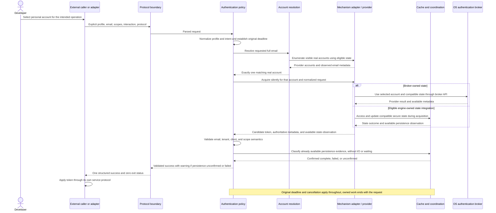
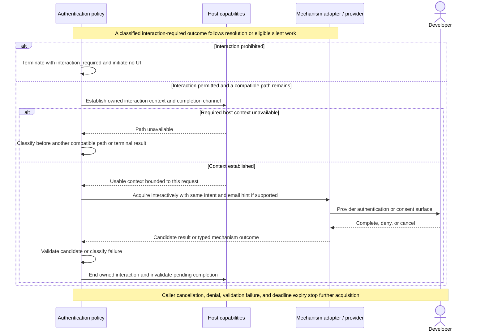
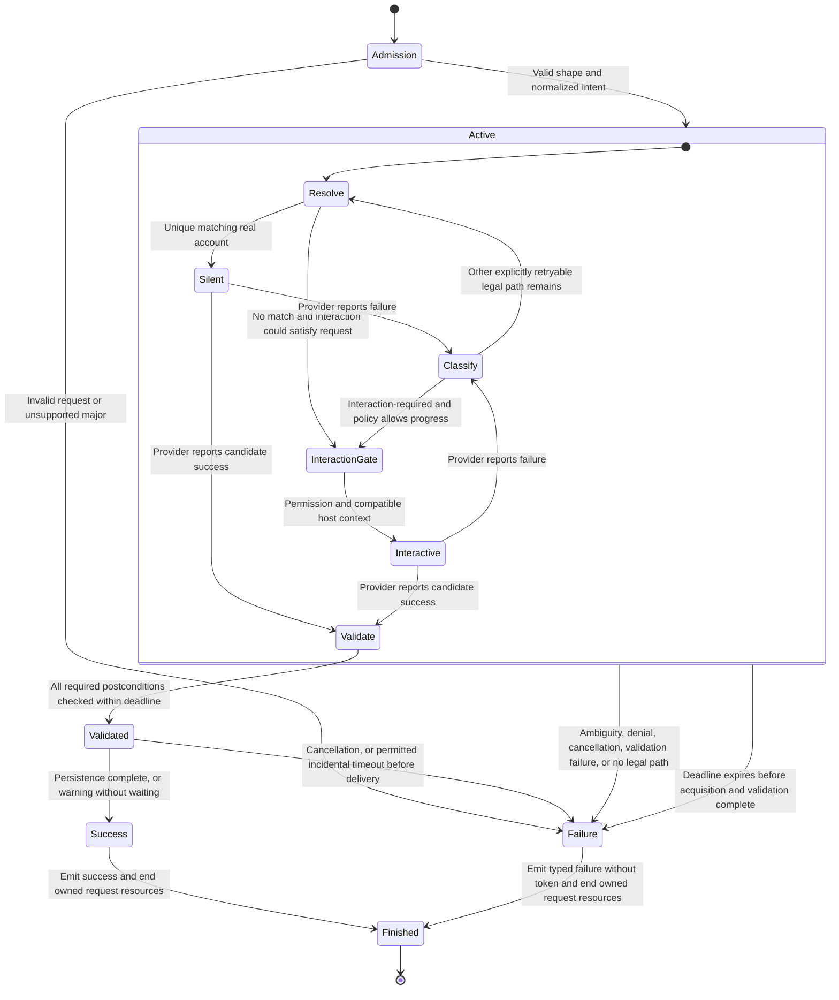

# Request and Reusable-State Lifecycles

The [Windows Slice design](../designs/windows-ado-authentication.md) specializes this
conceptual lifecycle with WAM-only ordering, broker-owned state, a versioned process
contract, owned Windows UI, and bounded cancellation/delivery. The alternative mechanisms
in this view are architectural possibilities, not additional paths enabled by that Slice.

This scoped architecture view connects the responsibilities in the
[overview](overview.md#level-3-cli-components) into complete request paths. Architecture
and security reviewers use it to assess lifetime and trust ownership; validation authors
use it to derive application-level scenarios. Capability requirements remain the behavior
authority. These UML sequence and state-machine views allocate behavior without selecting
classes, synchronization primitives, serialized schemas, or a provider implementation.

## Request Context and Trust

The protocol boundary handles argument shape and protocol-major admission. Authentication
policy resolves the selected Client Profile and normalizes email, scopes/resource,
cloud/client, effective tenant policy, interaction permission, and the one finite deadline
before provider work. Every later operation uses that same intent and cancellation scope.
Capabilities can exclude a path but cannot widen the request.

Provider accounts and candidate results remain inside the engine until the required
postconditions have been checked. Dependency contracts supply identity and scope metadata;
the engine compares that metadata with the normalized request. It does not reconstruct
identity from access-token claims or infer service eligibility from an OS login.

| Boundary | Relied-on responsibility | Engine responsibility |
| --- | --- | --- |
| Caller to protocol | Caller chooses the intended service and requested identity. | Validate explicit inputs, profile constraints, and protocol shape; reject conflicting intent. |
| Policy to MSAL/provider adapters | Maintained provider abstractions implement their documented authentication and result contracts. | Use eligible operations, classify outcomes, and check every required success postcondition. |
| CLI to host interaction | The selected host supplies its declared UI and completion capabilities. | Establish the engine's interaction context only with permission; stop owned work and invalidate late completion. |
| CLI to secure state | Platform storage and broker protect state within their declared trust model. | Respect ownership, select only compatible state, preserve integrity, and report persistence status accurately. |
| Validated result to caller | The caller protects and applies the returned bearer token to its intended resource. | Emit only the validated access token and allowed metadata through the terminal result. |

The [threat model](../security/threat-model.md) owns security assumptions and cost/risk
tradeoffs. These boundaries do not promise protection against a compromised current OS
user, administrator, kernel, or broker.

## Primary Journey: Selected-Account Silent Reuse

This path applies both to first use with eligible OS sign-in state and to a later
compatible invocation. It assumes that the selected profile/provider can supply a unique
real account and sufficient result metadata; that premise remains subject to the
[primary-journey gate](../validation/strategy.md#primary-journey-gate).

The sequence shows the successful path, not permission to bypass exceptional outcomes.
Zero matching accounts never initiates an ambient silent request. If permitted interaction
could satisfy the request, policy may enter the interaction path below; otherwise it
returns the applicable typed failure. Multiple matching accounts are terminal ambiguity.
A missing provider capability is unavailability, not proof that interaction will work.
A reported success lacking a required identity or scope postcondition is terminal
validation failure and does not reach the caller or another mechanism.

The alternatives show state ownership, not a selected platform order. Policy establishes
state eligibility before provider work. The final state call classifies information
already available from that work; it does not access the store again. The
[state-observation boundary](#state-ownership-and-persistence-observation) below applies
to both silent and interactive results.

## Interaction After a Silent Miss

Only a classified outcome can reach a later mechanism. The interaction decision belongs
to policy for the whole request, including state unlock. Host or provider code cannot
convert a silent operation into an interactive one implicitly.

No particular broker, browser, or device-code path is selected here. If the request ends
while interaction is pending, policy initiates termination immediately rather than waiting
for the user to complete the diagram. The host closes engine-controlled surfaces and
invalidates completion from externally owned surfaces it cannot close. Already completed
provider account or session changes are not rolled back by ending the engine request.

## Terminal State and Result Delivery

The state machine shows application states rather than a frozen public outcome schema.
The named outcomes are owned by
[`V2-REQ-032`](../product/requirements/result-and-process-protocol.md#v2-req-032-caller-action-failure-taxonomy).

The shared deadline bounds every retry and fallback; the loop is not an unbounded retry
policy. Resolution must still precede each silent attempt for a provider account source.
Unavailability and temporary failures advance only when the product policy explicitly
permits another compatible path. An unrecognized exception cannot become a retry by
default. Per-platform order and detailed retry budgets remain later choices.

Result selection and request-end cleanup form one terminal lifecycle. A normal result and
its exit status agree, and no engine-controlled acquisition, listener, lock, or persistence
work survives process termination. Cancellation cannot be overwritten by persistence
status. A late provider response cannot reopen an ended request. The engine relies on
dependency and OS lifetime contracts for work outside its control; it does not promise
revocation of provider sessions or recovery from an externally killed process.

After timely acquisition and validation, delivery never waits for persistence. Failed or
unconfirmed persistence adds the required machine-readable warning to success. If the
original deadline expires incidentally before delivery, the accepted success-or-timeout
latitude in
[`V2-REQ-015`](../product/requirements/strategy-interaction-and-host.md#v2-req-015-common-deadline)
still applies. Failure emits no access token. The diagrams do not choose a background
writer or relax the requirement that engine-controlled persistence ends with the request.

## State Ownership and Persistence Observation

Broker-owned state remains behind the broker API. The engine uses the documented account,
acquisition, and state-maintenance abstractions without inspecting broker files or
creating a shadow refresh-token cache. An engine-owned secure-state integration is needed
only for a provider path that requires it. Its responsibilities are compatible state
access, safe updates, and available completion or failure observations under the original
request lifetime. These are the existing cache-and-coordination responsibilities, not
another service.

The [pinned MSAL source assessment](../research/v1-public-contract-baseline.md#persistence-completion-and-observability)
shows why provider completion and persistence confirmation must be distinguished. Managed
MSAL can await cache callbacks before returning its result, while a cache helper can
catch a write failure internally. Acquisition includes such provider work under the
original deadline. The engine does not require MSAL to expose a token before its public
acquisition operation completes.

Once that operation has returned and success validation has completed within the deadline,
the result boundary classifies only the persistence evidence already available:

| Available evidence under the selected integration's contract | Delivery after successful validation |
| --- | --- |
| Safe persistence is confirmed complete. | Success without a persistence warning. |
| Safe persistence failed. | Success with the required persistence warning. |
| Safe persistence is pending or cannot be confirmed. | Success with the required persistence warning, without waiting for confirmation. |

Confirmation relies on the selected dependency or platform contract and its exposed
outcome; it does not require independently proving the storage implementation. A missing
confirmation signal alone does not make an otherwise eligible provider unavailable.
Conversely, acquisition success, token-source metadata, elapsed cache time, or a later
account-change event cannot be invented into a persistence receipt. The engine does not
read logs, perform a write/readback test, replay acquisition, or wait for a watcher at
result delivery. No background persistence service is introduced.

A provider failure before it supplies a candidate result remains an acquisition outcome
for policy classification; there is no partial token to salvage. Cancellation, deadline,
and success validation retain their normal priority. Any engine-controlled persistence
still pending must end with the request. The concrete integration must satisfy secure-only
state, recovery, integrity, and lifetime requirements; callback wiring, locking, and store
selection remain later design work. Source inspection of a cancellation parameter alone
does not establish that every storage operation honors it.

## Reuse Across Invocations and Consumers

Each process independently validates a new request. Cache coordination makes eligible
secure state available to the provider; account resolution and result validation remain
necessary even when the previous invocation succeeded. Changing only the caller,
repository, or package ecosystem does not introduce another sign-in requirement.

Reuse eligibility follows the account, effective tenant policy, selected profile/cloud,
resource and scopes, and security context. The provider owns the interpretation of its
token/cache format within its documented contract. The engine owns the request constraints
and its state-access policy, not a second token-matching or encryption implementation.
Sharing compatible state neither requires byte-identical tokens nor grants permission to
read another application's serialized cache.

Corrupt, unreadable, undecryptable, or incompatible state is not consumed. Recovery takes
the safe miss path and preserves interaction permission and the original deadline.
Concurrent invocations rely on the chosen state facility's locking and atomicity contract;
the engine must use it correctly for any engine-owned updates. A facility that cannot
satisfy integrity or secure-only persistence is not eligible. Concrete locking and storage
mechanisms remain unselected; duplicate interactive prompts across processes are not a
single-flight guarantee.

The [scenario matrices](../validation/strategy.md#cross-consumer-reuse-scenarios) provide
the observable validation basis. Real-platform feasibility, profile eligibility, and
support claims remain separately gated.
