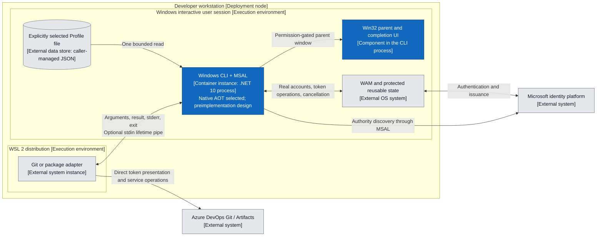
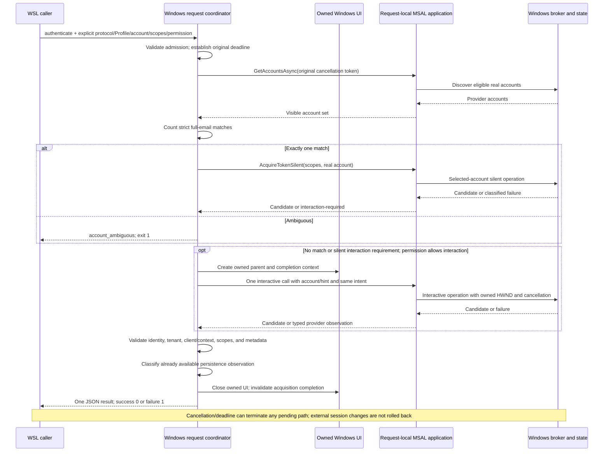
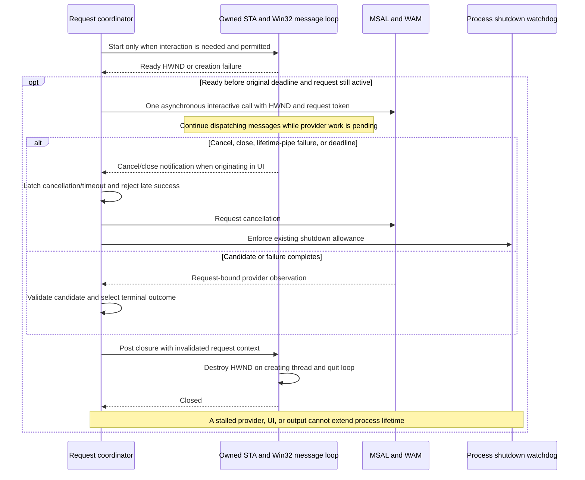
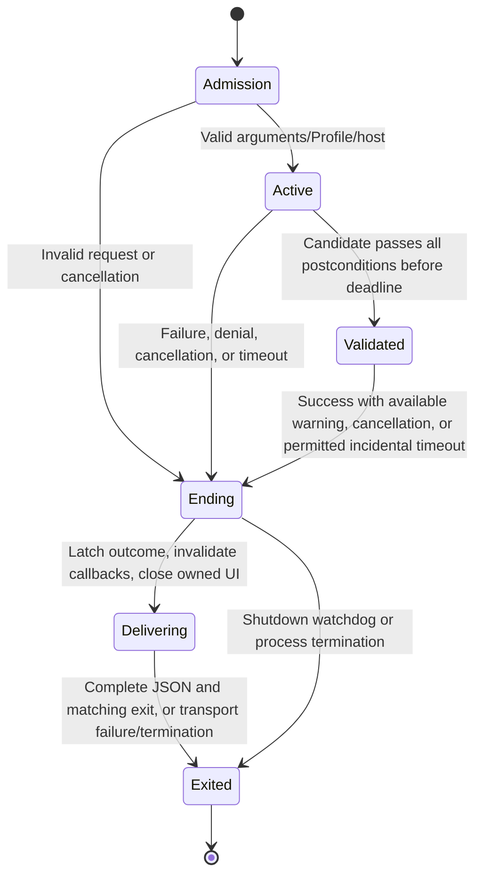

# Windows Azure DevOps Authentication Slice

This record owns the concrete Windows request implementation design and the protocol 1
command-line/process semantics. The linked JSON Schemas own serialized field shapes.
Requirements remain authoritative for required behavior; the
[architecture](../architecture/overview.md) owns system-wide boundaries. This is a
design record, not an activated Client Profile, executable, or support claim. The Native
AOT publishing disposition below selects the preimplementation path; product validation
remains outstanding.

## Selected Boundary and Dependencies

A WSL caller explicitly launches one Windows executable for one authentication request.
The same request design covers a selected personal Microsoft account and a selected work
account. Git and Azure Artifacts use the caller-supplied Azure DevOps scope; repository,
organization, feed, and package operations stay with the caller. The engine returns the
original delegated access token. The [PAT prohibition](../product/requirements/product-boundary.md#v2-req-005-no-personal-access-tokens)
applies to every operation, configuration, and failure path.

| Choice | Concrete design and reason |
| --- | --- |
| Runtime and UI | C# on .NET 10 LTS, `net10.0-windows`, `win-x64`; SDK 10.0.401 and runtime 10.0.12. A small in-process Win32 window replaces the Windows Forms host in the design below. It requires no Windows Desktop managed framework. |
| Authentication dependencies | `Microsoft.Identity.Client` and `Microsoft.Identity.Client.Broker` 4.83.1, with `Microsoft.Identity.Client.NativeInterop` 0.20.3. Preserve the existing probe's authentication dependency baseline while changing the managed host. |
| Provider | Windows WAM only. One real-account discovery, at most one selected-account silent call, and at most one permitted interactive call. No application-level network retry or second provider. |
| State | Broker-owned reusable state; a fresh in-memory MSAL application per invocation. No MSAL Extensions cache helper, serialized MSAL cache, shadow refresh-token store, engine account binding, or cross-process lock. |
| Host | Windows 11 x64 in an active interactive user session, with WAM available. WSL 2 callers use normal Windows executable interoperability. Service, impersonated, disconnected desktop, and native Linux hosts are outside this Slice. |
| Distribution | Executable basename, installer, signing, and update channel remain release identities under the [registry](../governance/operational-identities.yaml). `<windows-cli>` below denotes the caller-selected executable, not a new installed command. |

The [dependency assessment](../research/v1-public-contract-baseline.md#windows-slice-dependency-and-host-contracts)
binds these choices to public source. The .NET 10 synthetic evidence below supplements
the public framework contracts; the earlier .NET 8 authentication probe remains distinct.
Future upgrades must use the existing dependency review/validation matrix. No restore, build, or new
authentication experiment is part of accepting this design.

### Native AOT Target Disposition

Select **Native AOT** for the one .NET 10 `net10.0-windows` / `win-x64` executable
with the small in-process Win32 host, under
[V2-REQ-055](../product/requirements/quality-build-and-validation.md#v2-req-055-native-aot-publishing).
Retain SDK 10.0.401/runtime 10.0.12, MSAL/Broker 4.83.1 and NativeInterop 0.20.3.
The reviewed evidence resolves the preimplementation publishing premise for this
design. No non-AOT exception is needed. Implementation still requires a new accepted
Wave; this selection is not complete-application compatibility, release or support
acceptance.

The [latest synthetic results](../research/experiments/windows-native-aot.md#diagnostic-round-05-results)
establish a resolved public dependency graph, complete warning-free native compilation
with the selected provider surface rooted, and accepted publish completion. The native
EXE actually ran on the existing Windows host through WSL: it created MSAL configuration,
allocated native parameters, found the cleanup exports, returned from first and repeated
disposal without observed cleanup exceptions, and rejected the genuine x86 DLL. The
[earlier missing/decoy cases](../research/experiments/windows-native-aot.md#retained-native-artifact-runtime-results)
separately establish rejection under restricted search for their recorded artifact.
Public toolchain/Win32 contracts and these bounded observations support selecting the
path without changing authentication dependencies or relaxing DLL search.

This inference preserves the observation limits. The provider APIs were rooted for
compilation, not used for authentication. Disposal evidence does not inspect opaque
native deallocation; static imports and synthetic calls do not close dependencies used
only by actual WAM operations. The historical stops and unavailable diagnostics remain
in the experiment authority. Publish-only VCTIP cleanup does not relax product lifetime
requirements. The [validation basis](../validation/strategy.md#native-aot-publishing)
retains complete-application, WAM/UI, account/Profile, dynamic-dependency, symbol,
performance, release and support obligations.

The [public AOT assessment](../research/v1-public-contract-baseline.md#windows-native-aot-assessment)
distinguishes the following alternatives:

| Alternative | Disposition and reason |
| --- | --- |
| Existing Windows Forms host | Cannot be selected as a supported Native AOT route: Native AOT requires trimming, and Microsoft disables supported Windows Forms trimming because of built-in COM dependencies. Keeping this host would require a justified non-AOT exception; it is not necessary merely to own an HWND. |
| WPF replacement | Its documented trimming limitation does not resolve the blocker. |
| Small Win32 host with static interop | Selected Native AOT path: the required parent, public branding, completion and cancellation controls need only Win32 window APIs, an owned message loop, and statically known callbacks. This removes the managed desktop-framework blocker without another process or provider. |
| Larger UI framework or direct broker rewrite | No present UI requirement justifies another framework's dependency surface or replacing the supported MSAL integration with direct broker internals. Neither is needed for the selected smaller host. |
| Same Win32 host with ordinary self-contained JIT publishing | Future comparison baseline, not an accepted fallback or exception. Consider an exception only if later application validation identifies an AOT blocker that cannot reasonably be remediated, with the requirement's evidence and reassessment obligations. |

On implementation, enable `PublishAot` in the executable project, retaining AOT/trim
analysis during development. Owned libraries participate in compatibility analysis
without executable publishing settings. Do not apply this property to historical probes,
use blanket warning suppression, add dynamic plugins, or equate ReadyToRun/trimming with
Native AOT. Use source-generated P/Invoke for the finite owned Win32 API surface and
static `UnmanagedCallersOnly` callbacks with explicit ABI/layout. Built-in COM, runtime
code generation, reflection-based activation, and C++/CLI are not part of this host.

Read Profile JSON with a bounded `Utf8JsonReader`/explicit field reader, retaining the
existing duplicate-key, unknown-field, version, depth, and semantic validation. Write
result/event JSON from the existing field allowlists with `Utf8JsonWriter`; never serialize
arbitrary provider objects. These choices do not change the schemas or loosen input
validation. MSAL's own .NET 8 asset uses its generated JSON context; the separate Broker
asset targets .NET Standard 2.0 and does not inherit that AOT annotation automatically.

The accepted synthetic graph selects the public net8.0 Client, netstandard2.0 Broker,
net9.0 NativeInterop and `win-x64/msalruntime.dll` assets. Its loader/allocation evidence
applies to those exact assets; the older .NET Standard loader report and package metadata
do not replace that observation. The actual application's resolved graph must retain
reviewed public provenance and account for every native transitive requirement. Retain
the three authentication pins; changes require the existing dependency review.

Native assets belong in the application deployment directory with their notices. Before
provider initialization, constrain process DLL search to the application directory and
System32 with supported Windows loader controls; reject user-configured native paths.
Do not rely on the working directory, ambient `PATH`, development installations, runtime
extraction, or `Assembly.Location`. Do not enable direct P/Invoke for the broker library:
Native AOT's default binding and OS direct binding have different search semantics. The
exact upstream loader, its dependencies, and the process search restriction must be
validated together on the actual application; an incompatible loader makes the target
unavailable rather than silently weakening search rules or copying private runtime internals.

A separately authorized product publish must pin the Windows x64 public native build chain
(Visual Studio C++ tools, Windows SDK, and `link.exe`), SDK/runtime inputs, resolved
NuGet graph, and publish properties before execution. Microsoft's documented Windows
prerequisite is Visual Studio 2022 or later with Desktop development with C++ and its default
components; this record does not select a floating installed compiler. No compiler is
installed by this design revision. Artifact closure must include the native broker and
OS prerequisites; an AOT executable does not imply one-file deployment or no OS dependency.
Debug symbols have a separate diagnostic/release treatment and are included when
comparing total development and distribution costs.

The remaining work verifies the implemented application against the existing Windows
scenario and release gates. Actual WAM, account, UI and cancellation behavior still need
their appropriate evidence; synthetic success does not satisfy those gates. Investigate
precise supported dependency or host corrections if application validation finds a
blocker, before proposing a scoped exception. The historical .NET 8 probe is unchanged.

### C4 Deployment View

This view answers which process owns authentication, configuration, and cancellation.
Blue nodes are engine-owned; gray nodes are caller or platform dependencies.

## Protocol 1 Command-Line Contract

Invoke `<windows-cli> authenticate` followed by the arguments below. Options and enum
values are case-sensitive. Use separate option and value arguments; short aliases,
`--name=value`, positional targets, response files, and repeated scalar options are
invalid. Windows argument quoting is the caller's responsibility; the engine consumes
the resulting argument vector without invoking another shell.

| Argument | Meaning |
| --- | --- |
| `--protocol 1` | Required protocol major. No implicit version. |
| `--profile <absolute-Windows-file-path>` | Required selection of one Profile document, not inline client configuration. |
| `--account-email <full-email>` | Required strict account constraint. |
| `--scope <qualified-scope>` | Required, repeatable for permissions on exactly one resource. |
| `--interaction non-interactive-only\|interactive-if-needed` | Required permission for the entire request. |
| `--tenant common\|<tenant-GUID>` | Optional; normalize under the selected Profile's tenant policy. |
| `--timeout-seconds <integer>` | Optional, 1 through 600 inclusive; default 120. One monotonic deadline measured from managed entry, including Profile reading and validation. |
| `--cancel-on-stdin-close` | Optional valueless lifetime flag. Use a dedicated caller-owned pipe whose writer remains open until completion or cancellation. EOF or pipe failure cancels the request. Stdin is never an authentication request or credential channel. |
| `--telemetry off\|stderr` | Optional, default `off`. Enables only the bounded local event stream described below; it does not configure network export. |

The [request schema](../../contracts/v1/request.schema.json) describes the parsed argument
projection for validators and synthetic cases; it is not a stdin-JSON API. Defaults are
applied only after syntax validation. Duplicate scopes are rejected rather than silently
rewritten. Unknown options, absent required options, malformed values, unsupported
versions, and conflicts with a Profile produce `invalid_request` before provider work.
No environment variable supplies request intent or Profile selection.

`help` and root `--help` are non-authentication entry points and may print help to stdout.
Every attempted authentication invocation, including malformed ones, uses the terminal
result contract. An unsupported or absent version returns a protocol 1 `invalid_request`
envelope with a safe reason; it does not echo the unsupported input. This bootstrap
failure envelope remains recognizable independently of later supported major versions.

### Scope and Email Normalization

Accept a nonempty full email with one `@` and no whitespace/control characters, up to
320 characters. Preserve spelling and compare the whole string using ordinal
case-insensitive equality. Do not strip aliases, fold dots, rewrite domains, apply
Unicode normalization, or create an account-kind selector.

Each scope must contain an explicit resource prefix and a final permission segment.
Split at the last `/`: the prefix must be a GUID or an absolute application-ID URI with
an authority, no userinfo, query, or fragment; the last segment must be nonempty. This
covers the Azure DevOps GUID prefix and URI resources such as `api://<application-id>`
without a resource catalog. Reject unqualified permissions and identity-protocol scopes
as caller resource targets. MSAL may add its own OAuth protocol scopes internally.
Require the same resource prefix in all requested scopes using ordinal equality; do not
guess equivalence between different resource spellings. `/.default` must be the only
scope. For dynamic scopes, compare full provider-reported scope strings using ordinal
equality, allowing extra granted scopes. Missing coverage fails closed. For `/.default`,
validate the request/result association for the same resource and operation rather than
expecting its literal spelling in returned permissions.

These are deterministic core rules with table-driven unit-test value. They do not parse
access tokens or infer service authorization.

## Profile Contract and Ownership

The [Profile schema](../../contracts/v1/client-profile.schema.json) owns configuration
fields. A Profile has its own `schemaVersion`, name, client ID, Public Cloud selection,
tenant policy, integration kind, and explicit registration ownership/support metadata.
Protocol major and Profile schema version are separate version spaces. The current
reader accepts version 1 only and rejects unknown fields and duplicate JSON keys.

`--profile` is the sole lookup mechanism. Open that file once, read at most 64 KiB as
strict UTF-8 JSON, validate it, and retain an immutable in-memory snapshot for the request.
The path must be an absolute drive-qualified path on a local fixed Windows volume;
relative, drive-relative, UNC, device, and Linux paths are invalid. No environment or home
expansion, directory search, URL retrieval, symlink-management policy, or Profile writer
is introduced. The caller owns file provisioning, permissions, update, and deletion;
the engine never modifies the file. Trust ordinary OS access control within the current
user threat model. A read error is `invalid_request` with a safe configuration reason;
an expired deadline remains `timeout`. Do not report raw paths or file contents.

Configuration is public and nonsecret, but its integrity matters. The explicit file
selection and strict semantic checks prevent accidental use of an unrelated registration.
The engine does not search upstream locations or import upstream configuration. WSL
callers convert their chosen file path to Windows form before invocation. This explicit
caller-managed file requires no engine-owned configuration namespace or persistent
configuration service.

The two integration values filter compatible provider behavior without choosing an
acquisition order:

- `windows-wam`: ordinary public-client WAM integration, with no MSA passthrough.
- `visual-studio-legacy-wam`: Public Cloud only, client ID exactly
  `872cd9fa-d31f-45e0-9eab-6e460a02d1f1`, multitenant policy, and the legacy mapping
  already defined by the [client-identity architecture](../architecture/client-application-identity.md#provider-mapping).
  Only this integration enables the provider's legacy MSA passthrough option.

Both derive the broker redirect URI as `ms-appx-web://microsoft.aad.brokerplugin/<client-id>`.
Authority validation is enabled, multi-cloud behavior is disabled, and the trusted cloud
host is `login.microsoftonline.com`. Profiles cannot supply arbitrary hosts, redirect
code, secrets, scopes, cache modes, ordering, deadline defaults, prompt preferences,
telemetry destinations, or PAT behavior. Unsupported integrations fail admission.

### Visual Studio Legacy Candidate

The named example in the Profile schema is the concrete candidate definition. It is
schema documentation, not an installed/enabled Profile. An implementation must not
silently materialize or select it. Any eventual provisioned file uses the same parser
and explicit path selection as a user-created file.

Microsoft owns the registration. AzureAuth and GCM publicly use it; this fork has no
upstream endorsement, support commitment, or control over account eligibility, consent,
policy, or availability. Authentication, consent, and audit records can identify the
Visual Studio application rather than this fork. The owned UI must identify the fork,
display the Profile name and external owner as bounded plain text, and explain that the
provider controls the ensuing sign-in/consent display. It must not impersonate Visual
Studio or promise a particular Security Key, PIN, or MFA choice.

State sharing under this registration is intentional only through WAM APIs and compatible
account, tenant, client, resource, and Windows-user context. It does not authorize reading
Visual Studio, AzureAuth, or GCM serialized caches. No app-owned persisted state exists
to collide with those products. Changing Profile names alone neither changes the OAuth
client identity nor creates a new broker cache partition.

Before activation/distribution, the existing
[external Profile gate](../product/compatibility-and-migration.md#externally-owned-client-profile-gate)
still needs bounded personal/work-account, host/redirect, consent/audit/branding, strict
result, and reuse evidence. Registration rejection returns the existing failure outcome;
there is no alternate registration, PAT, or SelfDescribing fallback. Those acceptance
obligations are distinct from selecting this candidate's concrete design.

## Cohesive Request Implementation

Use one executable and one request coordinator. The CLI parser/serializer, Windows host,
and MSAL adapter are dependency boundaries; pure account, tenant, scope, and terminal
outcome rules are ordinary functions. Do not create a service/container/plugin framework
for these responsibilities. A provider seam and a host/clock seam suffice for scenario
validation; the number of conceptual architecture boxes is not a class count.

### Admission and Provider Setup

1. Establish the monotonic request start, bounded deadline, cancellation latch, and one
   terminal-result gate. Parse and validate the arguments and Profile before any account
   discovery or authentication. Honor cancellation during admission.
2. Normalize tenant policy once. A fixed Profile uses its fixed GUID and rejects a
   conflicting selector. Multitenant omission becomes `common`; an explicit GUID remains
   an exact resource-tenant constraint throughout.
3. Keep the provider factory and constructor inert. At the start of its first
   `GetAccountsAsync(originalToken)`, complete the local host admission below on request
   work, then construct a fresh `PublicClientApplication` using the chosen Profile and
   trusted cloud, with Windows broker enabled and `ListOperatingSystemAccounts = true`.
   Use no persistent cache callbacks, MSAL logging callback, default OS account sentinel,
   `cp1`, PoP, or username/password API. Keep provider PII/default logging disabled.
4. Check broker availability using the pinned synchronous `IsBrokerAvailable()` API;
   confine that dependency to the adapter. Install a rejecting
   `ICustomWebUi` before any interactive call so an MSAL fallback cannot open a browser
   if broker availability changes. Do not implement an OAuth exchange in that callback.
5. Use the concrete `ClientApplicationBase.GetAccountsAsync(CancellationToken)` overload,
   which exists even though the interface's older overload omits cancellation. Thread
   the original request cancellation token into it and every token operation.

Profile/client identity is bound by the application instance and its request-local
operation context. It is not inferred from token text. Every candidate carries that
context back to the coordinator; a callback for another or ended operation is discarded.

### Local Windows Host Admission

Microsoft's [WAM integration contract](https://learn.microsoft.com/entra/msal/dotnet/acquiring-tokens/desktop-mobile/wam#integration-best-practices)
requires an active interactive Windows user session capable of displaying UI, even for
silent acquisition. The checks below implement the selected host boundary; passing them
does not establish WAM health or broaden platform support. Perform them before creating
the real MSAL application or checking broker availability. A synthetic provider does not
need to inspect real logon state merely to exercise the owned window.

| Required local condition | Selected observation and rejection boundary |
| --- | --- |
| Windows 11 client on native x64 | Check Windows before any Windows import. Require both process and OS architecture to be x64, excluding x64 emulation on ARM64. Use `Environment.OSVersion` for NT 10.0, build at least 22000, and a positive workstation-product comparison with `VerifyVersionInfoW` / `VerSetConditionMask`, selecting only `VER_PRODUCT_TYPE`, `VER_EQUAL`, and `VER_NT_WORKSTATION`. A failed comparison rejects admission. |
| Calling thread is not impersonating | `OpenThreadToken(GetCurrentThread(), TOKEN_QUERY, TRUE, ...)` must fail specifically with `ERROR_NO_TOKEN`. A returned token, anonymous impersonation, or any other failure rejects admission. Capture the native error immediately and close any returned token. |
| Own process has an interactive local logon | Open only the current process token with `TOKEN_QUERY`. Use `GetTokenInformation(TokenStatistics).AuthenticationId` to query that one logon through `LsaGetLogonSessionData`. Require sufficient returned structure size, the matching LUID and a valid nonnull SID; reject LocalSystem, LocalService and NetworkService. Accept only `Interactive`, `RemoteInteractive`, `CachedInteractive` or `CachedRemoteInteractive`. Other types, including `NewCredentials`, reject admission. |
| Current session is actively connected | Obtain the current process's nonzero session ID with `ProcessIdToSessionId`. Query only that local session with `WTSQuerySessionInformationW(WTSConnectState)` and require a correctly sized `WTSActive` value. Unknown, disconnected, malformed or unavailable state rejects admission. |
| Visible station belongs to the local logon user | On the borrowed `GetProcessWindowStation` handle, require successful `GetUserObjectInformationW(UOI_FLAGS)` with `WSF_VISIBLE`. Require a bounded valid nonempty `UOI_USER_SID` equal to the own-logon SID. Missing associated user, mismatch or failed observation rejects admission. |
| Calling desktop currently receives input | On the borrowed `GetThreadDesktop(GetCurrentThreadId())` handle, require successful `GetUserObjectInformationW(UOI_IO)` with a true native BOOL. A desktop handle alone does not satisfy this condition. |

The [.NET OS architecture contract](https://learn.microsoft.com/dotnet/core/compatibility/interop/7.0/osarchitecture-emulation)
distinguishes the host from emulation. [.NET's OS version property](https://learn.microsoft.com/dotnet/api/system.environment.osversion?view=net-10.0)
supplies actual version discovery. The workstation comparison follows the public
[VersionHelpers.h product-type test](https://github.com/microsoft/win32metadata/blob/b07213e28bcc48221c155024f9c5e0e1a92c6497/generation/WinSDK/RecompiledIdlHeaders/um/VersionHelpers.h#L135-L142);
`IsWindowsServer` itself is an inline helper, not an exported entry point. Do not use
the deprecated, manifest-sensitive `VerifyVersionInfoW` API to discover major/minor/build.
Its [type-mask contract](https://learn.microsoft.com/windows/win32/api/winbase/nf-winbase-verifyversioninfow)
ignores unselected fields. Build 22000 identifies the
[original Windows 11 generation](https://learn.microsoft.com/windows-insider/older-windows-insider-preview-builds#windows-11,-version-21h2-original-release),
not compatibility with every later product or servicing release.

The [thread-token API](https://learn.microsoft.com/windows/win32/api/processthreadsapi/nf-processthreadsapi-openthreadtoken)
does not revert impersonation when `OpenAsSelf` is true. The
[own-logon query](https://learn.microsoft.com/windows/win32/api/ntsecapi/nf-ntsecapi-lsagetlogonsessiondata)
requires no administrator role for the session owner. Its
[logon-type contract](https://learn.microsoft.com/windows/win32/api/ntsecapi/ne-ntsecapi-security_logon_type)
distinguishes `NewCredentials`, which can keep the local identity while replacing outbound
credentials. The station SID comparison detects a different local user; it does not prove
equal logon sessions or exhaustively detect same-user alternate-launch provenance. Retain
normal launch as an acceptance precondition; do not silently require `LOGON_WINLOGON`,
another user's token, a shell process, or privileged `WTSQueryUserToken` access.

The [WTS query](https://learn.microsoft.com/windows/win32/api/wtsapi32/nf-wtsapi32-wtsquerysessioninformationw)
can fail when Remote Desktop Services is unavailable. A session ID is not substitute
connection evidence; return unavailable without starting or repairing the service. Do
not impose a physical-console-only condition. The
[user-object information contract](https://learn.microsoft.com/windows/win32/api/winuser/nf-winuser-getuserobjectinformationw)
defines both associated-user SID and input-desktop observations. Neither visible station
surfaces nor `OpenInputDesktop` success alone proves all required conditions.

Recheck the original token before and after each synchronous observation, before
classifying its result or releasing the next effect. A rejected or unobservable required
condition yields the existing sanitized `mechanism_unavailable`; cancellation/deadline
retain precedence and programming faults retain `internal_failure`. No native diagnostic,
SID, LUID, session ID or returned account metadata enters results, stderr or telemetry.
Bound variable buffers and parsing; use static System32 interop with reviewed ABI layouts.
Close owned process/thread token handles, free WTS buffers with `WTSFreeMemory`, and free
the LSA buffer once with `LsaFreeReturnBuffer` after SID comparisons finish. Its SID remains
borrowed; station, thread-desktop and pseudo-handles remain borrowed too. Never inspect or
copy the returned LSA name, domain, UPN, profile-path or logon-server strings. The query
still retrieves local metadata, which the later execution protocol must explicitly cover.

Stable process architecture and logon observations need not be repeated in this process,
which never changes identity. Recheck calling-thread impersonation, session connection
and input desktop immediately before each later provider operation. For real-provider
interaction, recheck those volatile conditions on the actual owned UI thread before
native creation and before showing/publishing its parent, as well as on the calling
thread before the interactive provider effect. Retain the coordinator's post-readiness
token check and terminal/show synchronization. Rejection closes any owned UI through the
same lifetime path; it cannot restart acquisition. There is no background polling,
wait-for-unlock, identity/desktop switching or new timeout. Synchronous checks run on
request/UI work, with the independent process watchdog retaining its existing bound.

In pinned MSAL 4.83.1, [IsBrokerAvailable](https://github.com/AzureAD/microsoft-authentication-library-for-dotnet/blob/d5d7de6b103f0d9dd7bca9bf13cbb9f3da37bc9f/src/client/Microsoft.Identity.Client/PublicClientApplication.cs#L91-L98)
is synchronous, has no cancellation parameter, and marks obsolescence only under its
Android/iOS conditional. Its [runtime broker](https://github.com/AzureAD/microsoft-authentication-library-for-dotnet/blob/d5d7de6b103f0d9dd7bca9bf13cbb9f3da37bc9f/src/client/Microsoft.Identity.Client.Broker/RuntimeBroker.cs#L685-L708)
can initialize process-global `NativeInterop.Core`. It is a provider effect after local
admission, bracketed by original-token checks, not an inert installed-package probe.
False or recognized initialization failure follows the existing unavailable mapping;
success does not prove account visibility, UI or persistence. Do not poll it or add
account discovery to verify availability. Preserve the rejecting custom web UI.

These predicates are snapshots, not an atomic freeze of the Windows session or a defense
against a compromised current user. The selected normal host and exact Native AOT
interop still require the evidence in the [validation strategy](../validation/strategy.md#windows-slice-design-acceptance).
This design admits no local metadata query, broker initialization or account experiment;
execution retains its accepted Wave, exact protocol and source/artifact review gates.

### Managed HTTP Identity

The [operational identity registry](../governance/operational-identities.yaml) owns the
fork's HTTP product token and development-version behavior. The Windows adapter supplies
one thread-safe, process-owned HTTP client through MSAL's supported
`WithHttpClientFactory(IMsalHttpClientFactory)` seam. A small managed handler adds the
selected product/version token once to each outgoing `User-Agent`, including when MSAL
has supplied its own request header. Preserve dependency-owned product tokens; do not
add account, tenant, Profile, token, machine or persistent identifiers. Forward the
original cancellation token and introduce no application retry or telemetry exporter.

The pinned MSAL 4.83.1
[builder](https://github.com/AzureAD/microsoft-authentication-library-for-dotnet/blob/d5d7de6b103f0d9dd7bca9bf13cbb9f3da37bc9f/src/client/Microsoft.Identity.Client/AppConfig/BaseAbstractApplicationBuilder.cs#L66-L93)
accepts this factory, and its
[HTTP manager](https://github.com/AzureAD/microsoft-authentication-library-for-dotnet/blob/d5d7de6b103f0d9dd7bca9bf13cbb9f3da37bc9f/src/client/Microsoft.Identity.Client/Http/HttpManager.cs#L214-L259)
sends managed requests through the returned client. Microsoft's
[HTTP client contract](https://learn.microsoft.com/entra/msal/dotnet/advanced/httpclient)
requires safe client reuse and states that MSAL does not dispose the client. The
one-process host owns its lifetime. `WithClientName` and `WithClientVersion` alone are
not evidence that an HTTP `User-Agent` was set.

This selection applies to fork-owned managed requests, including MSAL authority
discovery when needed. WAM/native broker transport and its HTTP identity remain
dependency-owned; no claim is made that the managed factory controls those requests.
The OAuth client registration, consent/audit identity, mechanism and Profile gates are
unchanged. A synthetic message-handler test must establish header behavior before the
networked adapter executes; real authentication retains its Wave/protocol and owner
risk-decision prerequisites.

### Resolution, Acquisition, and Failure Classification

Use MSAL's returned real accounts as the visible account set. Do not consult upstream
files, OS-account sentinels, a previous chosen-account binding, or a different source
after ambiguity. Count exact full-email matches: zero permits interaction only if the
host/Profile can perform it, one permits silent acquisition with that `IAccount`, and
more than one is terminal `account_ambiguous`. Missing account email is not a match.

For a unique real account, call `AcquireTokenSilent(scopes, account)` before considering
interaction. Preserve the normalized tenant constraint separately from the provider
route. Under the legacy integration and `common` only, a resolved MSA home-account tenant
selects the public transfer tenant `f8cdef31-a31e-4b4a-93e4-5f571e91255a` for silent use;
the initial authority is `organizations` with passthrough. An explicit resource GUID
always wins and is never replaced. This mapping comes from the existing architecture,
not from an email suffix or a new account-kind request.

Only no match or a classified `MsalUiRequiredException` can advance to the one interactive
call. With permission, establish the owned UI first. The pinned builder makes
`WithAccount` and `WithLoginHint` mutually exclusive: use `WithAccount` for the
uniquely resolved real account, from which MSAL derives the observed username hint;
otherwise use `WithLoginHint` with the requested email. Preserve the original request
email separately, including when its casing differs from the observed account spelling.
Neither choice replaces strict final matching. The pinned
[interactive builder](https://github.com/AzureAD/microsoft-authentication-library-for-dotnet/blob/d5d7de6b103f0d9dd7bca9bf13cbb9f3da37bc9f/src/client/Microsoft.Identity.Client/ApiConfig/AcquireTokenInteractiveParameterBuilder.cs)
and [request parameters](https://github.com/AzureAD/microsoft-authentication-library-for-dotnet/blob/d5d7de6b103f0d9dd7bca9bf13cbb9f3da37bc9f/src/client/Microsoft.Identity.Client/Internal/Requests/AuthenticationRequestParameters.cs)
own that API behavior. Forward an opaque claims challenge
only when it came from this request's silent exception. No caller claims payload,
cross-process continuation, automatic interactive retry, or browser/device-code path is
provided. MSAL/WAM may perform their own documented protocol steps within the original
cancellation/deadline boundary.

| Observation | Coordinator outcome/action |
| --- | --- |
| Admission or Profile semantic error | `invalid_request`; no provider call. |
| No visible match or provider interaction requirement | `interaction_required`, or the one compatible interactive call when permitted. |
| Multiple exact visible matches | `account_ambiguous`; no silent call or picker. |
| Broker unavailable, unsupported session, or rejected web fallback | `mechanism_unavailable`; no alternate mechanism. |
| Caller cancellation, owned-window close, or provider user cancellation | `cancelled`; no retry. The local cancellation/deadline latch determines its own origin before interpreting a provider cancellation code. |
| Recognized provider denial, including OAuth `access_denied` or AADSTS65004 | `denied`; no retry. Do not classify all service exceptions as denial. |
| Recognized network/service transient or provider `IsRetryable` hint | `temporarily_unavailable`; no application retry in this Slice. |
| Required result postcondition absent or mismatched | `identity_validation_failed`; discard the candidate token and stop. |
| Original deadline reached before complete validation | `timeout`; invalidate late completion. |
| Unrecognized provider/native failure or application defect | `internal_failure`; no fallback or raw exception export. |

Map codes through an explicit bounded table using structured provider codes/statuses,
never message substring parsing. Safe reason strings identify categories such as
`invalid_profile`, `consent_required`, `broker_unavailable`, `provider_denied`,
`provider_transient`, `metadata_missing`, or `provider_failure`; they never contain
arbitrary provider text. An interactive call that again requires interaction terminates
as `interaction_required`. State-related interaction requirements follow the same
permission policy; an unexplained broker failure does not authorize account deletion,
cache repair, or retries.

### Adapter Observation Boundary

Evaluate original-token cancellation before interpreting provider observations;
the existing request lifetime determines cancellation versus the original
deadline. Use ordinal provider-code comparison. Known cancellation, denial, and
identity mismatch precede the broader UI-required and retryable branches.

| Public observation | Existing outcome and reason |
| --- | --- |
| Original operation token is canceled | Propagate cancellation carrying that token. |
| `authentication_canceled` | `cancelled`. |
| `access_denied` or positively recognized structured Entra code 65004 | `denied`. |
| `user_mismatch` | `identity_validation_failed`. |
| `MsalUiRequiredException` | `interaction_required`; `ConsentRequired` classification uses `consent_required`. |
| Explicit availability/host failure, rejecting custom UI, `platform_not_supported`, or `wam_runtime_init_failed` | `mechanism_unavailable`. |
| Remaining `MsalException.IsRetryable` | `temporarily_unavailable` / `provider_transient`. |
| `service_not_available` or `temporarily_unavailable` | `temporarily_unavailable` / `service_transient`. |
| `network_not_available`, or `HttpRequestException` with NameResolutionError/ConnectionError | `temporarily_unavailable` / `network_transient`. |
| HTTP cancellation with an inner `TimeoutException` while the original token remains active | `temporarily_unavailable` / `network_transient`. |
| Other observations, including unexplained cancellation and unknown configuration/native errors | `internal_failure`. |

The MSAL exception type and its public retry hint already normalize the relevant
broker statuses. Do not duplicate a private native enum or interpret
AdditionalExceptionData numeric values as Entra error codes. A provider timeout
does not establish expiry of the caller's deadline. No branch introduces an
application retry, alternate mechanism, account repair, or raw diagnostic export.
Only claims from this request's silent UI-required exception may reach its single
interactive continuation; a subsequent challenge ends the request.

For the accepted 65004 denial example, inspect only a bounded public
`MsalServiceException.ResponseBody`: at most 8,192 UTF-16 code units before JSON
parsing, maximum JSON depth 8, and at most 16 top-level `error_codes` entries.
Require one root object and exactly one case-sensitive `error_codes` property
whose complete array consists of Int32 integers. Recognize 65004 only after
validating the entire document and array. Reject duplicates, trailing syntax,
comments, trailing commas, malformed data, and exceeded bounds. Never inspect
messages, descriptions, URLs, inner-exception text, or nested error-code arrays
to infer denial. These bounds limit recognition work; they are not a public
input contract or evidence that all real WAM denials can be distinguished.
Unrecognized details contribute no denial evidence; independent known codes,
types, and retry hints retain their defined precedence.

[Microsoft's error reference](https://learn.microsoft.com/entra/identity-platform/reference-error-codes) identifies `error` as the application reaction code
and numeric `error_codes` as diagnostic information. It explicitly warns that
the numbers can change and that applications depending on them can break.
Recognizing the existing design's 65004 example is a bounded repository mapping
choice based on its currently documented meaning, not a stable MSAL or service
contract. Pinning MSAL does not freeze service diagnostics. Reassess this narrow
premise when accepting or revising the mapping and at release review through
`RECHECK-009` in the existing [recheck registry](../research/rechecks.yaml). That review cannot create stability
or complete observability that the provider does not promise.

Some pinned account-discovery failure paths return an empty list. Supported
public APIs cannot reconstruct that hidden reason; apply the existing no-match
permission policy and retain that evidence limitation. No extra discovery or
private diagnostic path is introduced.

The exact custom-UI interface spelling is
`Microsoft.Identity.Client.Extensibility.ICustomWebUi`. Its implementation always
rejects navigation with the sanitized mechanism-unavailable failure. Directly
testing that callback does not prove real broker-disappearance behavior.

The exact source basis is MSAL 4.83.1 commit
`d5d7de6b103f0d9dd7bca9bf13cbb9f3da37bc9f`:
[exception evidence](https://github.com/AzureAD/microsoft-authentication-library-for-dotnet/blob/d5d7de6b103f0d9dd7bca9bf13cbb9f3da37bc9f/src/client/Microsoft.Identity.Client/MsalServiceException.cs),
[UI-required classification](https://github.com/AzureAD/microsoft-authentication-library-for-dotnet/blob/d5d7de6b103f0d9dd7bca9bf13cbb9f3da37bc9f/src/client/Microsoft.Identity.Client/MsalUiRequiredException.cs),
[broker translation](https://github.com/AzureAD/microsoft-authentication-library-for-dotnet/blob/d5d7de6b103f0d9dd7bca9bf13cbb9f3da37bc9f/src/client/Microsoft.Identity.Client.Broker/WamAdapters.cs),
and [custom UI contract](https://github.com/AzureAD/microsoft-authentication-library-for-dotnet/blob/d5d7de6b103f0d9dd7bca9bf13cbb9f3da37bc9f/src/client/Microsoft.Identity.Client/Extensibility/ICustomWebUI.cs).
The .NET 10 [HTTP cancellation contract](https://learn.microsoft.com/dotnet/api/system.net.http.httpclient.sendasync?view=net-10.0)
and [network categories](https://learn.microsoft.com/dotnet/api/system.net.http.httprequesterror?view=net-10.0)
supply the non-MSAL observations. These are source contracts and repository mapping
choices; controlled exception/result fixtures cannot establish real denial, broker,
UI, account discovery or network behavior.

### UML Request Sequence

The diagram's success tail applies only to a candidate that passed validation. Ambiguity,
denial, cancellation, timeout, and invalid candidates do not continue to it.

### Authoritative Result and State Observations

Validate `AuthenticationResult.Account?.Username`, `TenantId`, `Scopes`, `TokenType`,
`ExpiresOn`, nonempty access token, and operation context. Require the requested email,
the exact tenant when constrained, and the same client/cloud/resource context. Preserve
the provider's email spelling, tenant, token type, expiration, granted scopes, and
correlation GUID when nonempty. Reject already expired candidates; impose no additional
minimum remaining lifetime. Use provider metadata rather than parsing an access or ID
token in application code.
Missing account email and invalid or missing tenant metadata remain missing in the
adapter projection; requested values must not fill them. Keep the request-local
operation identifier separately from the observed correlation ID. The pinned
[public result shape](https://github.com/AzureAD/microsoft-authentication-library-for-dotnet/blob/d5d7de6b103f0d9dd7bca9bf13cbb9f3da37bc9f/src/client/Microsoft.Identity.Client/AuthenticationResult.cs)
provides the observed fields; projection does not establish persistence.

The public `authority` is the canonical Public Cloud authority URI formed from the
validated single-cloud operation and actual `TenantId`:
`https://login.microsoftonline.com/<actual-tenant-guid>`. It identifies the resulting
cloud/tenant, not a network trace, home-tenant claim, or the initial `common`,
`organizations`, or transfer routing alias. MSAL's public `AuthenticationResult` does
not expose a literal final endpoint URI; the contract does not invent one. A missing
actual tenant or unverifiable cloud association fails validation.

The adapter reports `wam` and whether the successful API operation was `silent` or
`interactive`. This describes the API used, not a claim about which MFA option the user
saw or whether an interactive API happened to complete without a visible prompt.

WAM owns persistence, locking, corruption handling, and account/session state. Use its
documented operations without inspecting its files or resetting accounts. A clean
interaction-required/miss indication may proceed through the normal permission gate;
an unusable or unverifiable candidate cannot succeed. There is no owned cache to repair.
The pinned public result has no per-request durable-write receipt, so successful results
carry `persistence_unconfirmed`. This warning does not claim persistence failed, disable
future reuse, or require a readback. Do no post-validation persistence I/O or waiting.

## Windows UI and Request Lifetime

The candidate uses a small Win32 window on an owned STA thread with a message loop only when
interaction is both needed and permitted. It supplies a stable nonzero HWND and explicit
cancel/close behavior. It does not ask for account email, passwords, URLs, or credentials;
those belong to the caller's request and provider UI. Parent WAM with that HWND, use the
specified login hint, and let WAM choose sign-in/MFA/consent methods. Failure to create the
owned parent makes the path unavailable before the interactive call.

The UI thread registers the window class and creates/destroys its HWND. Use standard
Windows text/button controls, keyboard navigation, accessible names and system visual
settings; show the bounded public branding/ownership text required above and an explicit
Cancel action. No custom credential form, embedded browser, COM automation or rich-text
rendering is needed. Accessibility and DPI/focus behavior remain host-validation cases.
Keep the window-procedure callback and request context alive through window destruction;
unmanaged callbacks must not unwind managed exceptions across the ABI boundary.

The coordinator awaits a ready HWND or a typed creation failure under the original
deadline before the one interactive call. Its asynchronous MSAL work must not block the
UI message pump with `.Result`, synchronous waits, or synchronous cross-thread window
messages. UI cancel/close signals the request cancellation latch. Terminal completion
invalidates the request context and posts owned-window closure to the creating thread;
that thread destroys its windows and quits its loop. A queued completion cannot recreate
UI or authorize success after cancellation. If creation, dispatch or destruction stalls,
the existing one-process shutdown watchdog remains the final bound.

### UML UI Ownership and Cancellation Sequence

No visible window or prompt is created for a prohibited-interaction request. Broker
discovery and silent APIs are the eligible no-interaction operations; no opaque default
account call is used. The engine cannot promise that a malfunctioning OS is repaired by
application code. A dependency contract regression makes that combination ineligible.

The coordinator races provider completion against the original cancellation/deadline
latch. Cancellation sources are Windows console cancellation when delivered, owned UI
cancel/close, and EOF/failure on the optional lifetime pipe. With
`--cancel-on-stdin-close`, stdin must be a redirected pipe; reject a console or regular
file before provider work. The caller must retain the sole writer and avoid leaking it
to descendants. Data is not interpreted or logged; the reader only observes closure.
An already closed pipe cancels before authentication.

Without that flag, stdin is unused. WSL Linux signals and Linux parent-process death are
not assumed to become Windows cancellation notifications. A caller needing prompt
disconnect cancellation supplies the lifetime pipe; otherwise the finite CLI deadline
is the backstop, and a broken output pipe ends delivery when detected. Immediate detection
of an arbitrary Linux parent's death without a lifetime channel is explicitly unsupported.
Do not discover Linux process IDs, create listeners, or add a helper service to infer it.

On any terminal acquisition outcome, latch the outcome, reject later callbacks, cancel
the provider token, close owned UI, and stop initiating work. Deliver at most one result.
Caller cancellation observed before result commitment wins over a candidate success or
persistence warning. Deadline expiry before complete validation yields `timeout`;
incidental expiry after timely validation may use the requirements' success-or-timeout
latitude. Once delivery starts, a concurrent cancellation cannot rewrite a partial JSON
object: finish the selected result or terminate with incomplete output, never emit a
second object.

Anonymous-pipe I/O may block. Use dedicated bounded-lifetime I/O work and a process-level
shutdown watchdog, not an assumption that `WriteAsync` makes an anonymous pipe cancellable.
At cancellation or expiry, allow at most one second for local closure/result delivery;
no acquisition, retry, persistence wait, or renewed deadline occurs in this shutdown
interval. If owned cleanup or transport cannot finish, terminate the one process. OS
process termination releases its threads and handles; external WAM services remain OS
owned. A forced termination or incomplete write is a transport failure, not a fabricated
typed result. This is the exceptional fail-closed boundary, not a resident watchdog
process or a mechanism for making unsupported platforms work.

The managed process host keeps its entry thread as the watchdog and moves request
work, native handle I/O, and cleanup onto dedicated background work. It reads the
original deadline and first terminal/cancellation timestamps without waiting on
request locks. Result commitment is serialized with host cancellation; complete
native transfer and required operation, cancellation-callback, and lifetime-pipe
drain are prerequisites for a matching result exit. Pipe admission runs within the
original request lifetime and precedes Profile access. An initially closed pipe
cannot release Profile work while cancellation propagation is pending. Optional
diagnostics have separate bounded bytes and do not participate in required drain.

External broker windows/session changes are not forcibly rolled back. Forward cancellation
through MSAL, close the owned parent, invalidate completion, and write a fixed sanitized
completion/cancellation indication to stderr when available. Do not wait for the user to
dismiss an external surface before ending the CLI process.

### UML Terminal State View

## Result, Diagnostics, and Compatibility

The [result schema](../../contracts/v1/result.schema.json) defines one UTF-8 JSON object
followed by LF, with no BOM. Exit `0` means a complete `success` object; exit `1` is
shared by every complete typed failure. Failure objects contain no token or account
metadata. A success with `persistence_unconfirmed` still exits zero. Invalid/partial
JSON, process kill, absent output, or mismatched exit status is a caller-observed
transport/protocol failure and must not be converted into an engine outcome.

Build the result from an allowlist of fields, not by serializing an MSAL result or
exception. Only `accessToken` in a validated success may expose authentication material.
Do not emit refresh/ID tokens, claims, account IDs, raw exceptions, provider property bags,
or diagnostic email hashes. Keep stdout exclusively for that result.

Stderr carries bounded fixed human indications and, only with `--telemetry stderr`, local
JSON event lines containing `event`, `stage`, `outcome`, and elapsed milliseconds. Events
contain no token, email, path, Profile/client/account identifier, tenant, resource, scope,
claims, or provider text. This is optional local telemetry; network export and persistent
telemetry identifiers are not provided by this Slice. Bound pending diagnostic/event
output to 8 KiB, drop excess, never await a flush at result delivery, and ignore sink
failure without changing authentication or exit status. The process watchdog covers a
blocked diagnostic writer too. No upstream telemetry configuration is read.

Protocol 1 producers emit only the defined fields. Consumers must tolerate unknown
additional result fields but still validate the known outcome and required fields;
additive optional result metadata is compatible. Request and Profile readers reject
unknown inputs so typos cannot become silently ignored intent. Existing flags, defaults,
outcomes, and result meanings cannot be changed incompatibly while protocol 1 remains
supported. A breaking request/result change requires a new major; a breaking Profile
interpretation requires a new Profile schema version. No v1 AzureAuth compatibility is
implied, and no protocol is published as supported merely by merging this design.

## Validation and Explicit Unsupported Cases

The [Slice scenario basis](../validation/strategy.md#windows-slice-design-acceptance)
owns cases and required evidence. Contract examples are synthetic and demonstrate schema
shape only. Core normalization/selection/outcome rules receive unit tests; ordinary
orchestration is validated by scenario outcomes, provider calls, observed UI/lifetime,
and output effects rather than private class structure.

Unsupported in this Slice: native Linux/macOS authentication, WSL forwarding, non-Public
Cloud, Windows services/impersonation/disconnected sessions, ARM64, browser/device code,
PoP, confidential/workload credentials, PATs and derived-credential exchange, opaque OS
account selection, alias equivalence, stable account selectors, cross-process claims
continuation, shared-cache import/repair, logout/cache commands, duplicate-prompt
suppression, network telemetry export, Profile auto-discovery/activation, and immediate
Linux-parent-death detection without the lifetime pipe. Git clone and NuGet restore
remain downstream service tests, not operations of this engine.

Design acceptance requires complete contracts, scenario obligations, reviewed dependency
premises, and security/TMT consistency. Implementation, Profile activation, and platform
support each retain their later authorization and evidence gates. The existing personal
account probe is positive mechanism evidence for its .NET 8 host and state; it does not
replace future .NET 10, company-account, fresh-state, cancellation, or feed validation.
